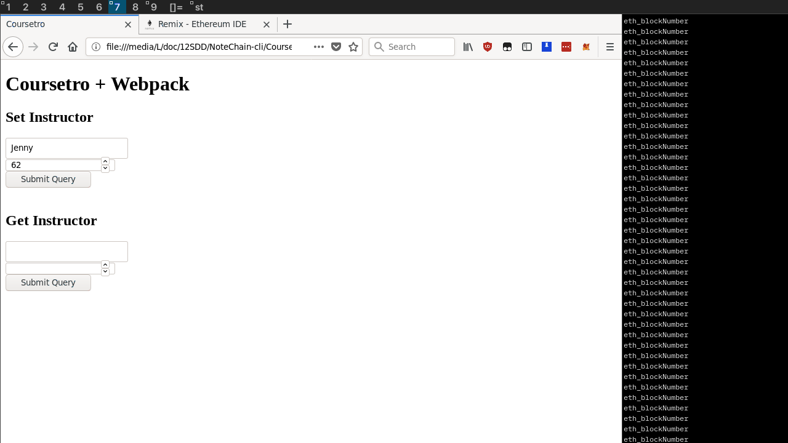

I've updated the [NoteChain](https://gist.github.com/dylan-lom/de7abbe220df2bf81fa3183ebb3303bd) contract for compiler version 0.5.1, just for ease of use atm.

I'm not particularly sure how to prepare arguments before passing them to the solidity contract -- in particular the bytesX type — I've found <a href="https://ethereum.stackexchange.com/questions/23058/how-to-convert-string-to-bytes32-in-web3js">this SO question</a>, however it only addresses bytes32, wheras NoteChain takes bytes2 as the publicKey (which I'm still unsure if it's necessary).

We need to truncate the output of fromAscii, e.g.
<pre><code>web3.utils.asciiToHex('ts');
//returns: '0x7473000000000000000000000000000000000000000000000000000000000000'</code></pre>
Turns out, this is easy but unclear due to <a href="https://ethereum.stackexchange.com/questions/23058/how-to-convert-string-to-bytes32-in-web3js">some confusing documentation (length argument is not mentioned in example call)</a>
<pre><code>web3.utils.asciiToHex('ts', 2);
//returns: '0x7473'</code></pre>

As a practice run, I've compiled the [Coursetro](https://coursetro.com/courses/20/Developing-Ethereum-Smart-Contracts-for-Beginners) contract and a web page to interact with it in webpack

As an independant .html:

As a chrome extension:
[tba]

Learning experiences:
* <strike>Exporting required functions to the window namespace seems to work more consistantly than adding the .onclick=... via js<strike>for chrome extensions, inline onclick is disabled for 'safety' reasons.
* Node uses the 'global' namespace to refer to native js' 'window' -- webpack transpiles references to 'global.X' => 'window.X'
* For some reason, the method I was using to get an account before, <code>web3.eth.getAccounts()[0]</code> doesn't work, maybe I'm doing something wrong, A better of way of doing this is: <code>web3.eth.getAccounts( (err, resp) => { global.acc = resp[0]; } );</code>, although for some reason this only works in the interactive node console.
* To prevent the webpage from re-loading on submission, we return false after our onclick statement, e.g. <code>onclick="myFunc(); return false;"</code>
* Solidity contracts return a [Promise](https://developer.mozilla.org/en-US/docs/Web/JavaScript/Reference/Global_Objects/Promise), which we need to handle via a .then(function(val){...})
* Contracts return a BigNumber, which need to be converted to an int via their method <code>BN.toNumber()</code>
