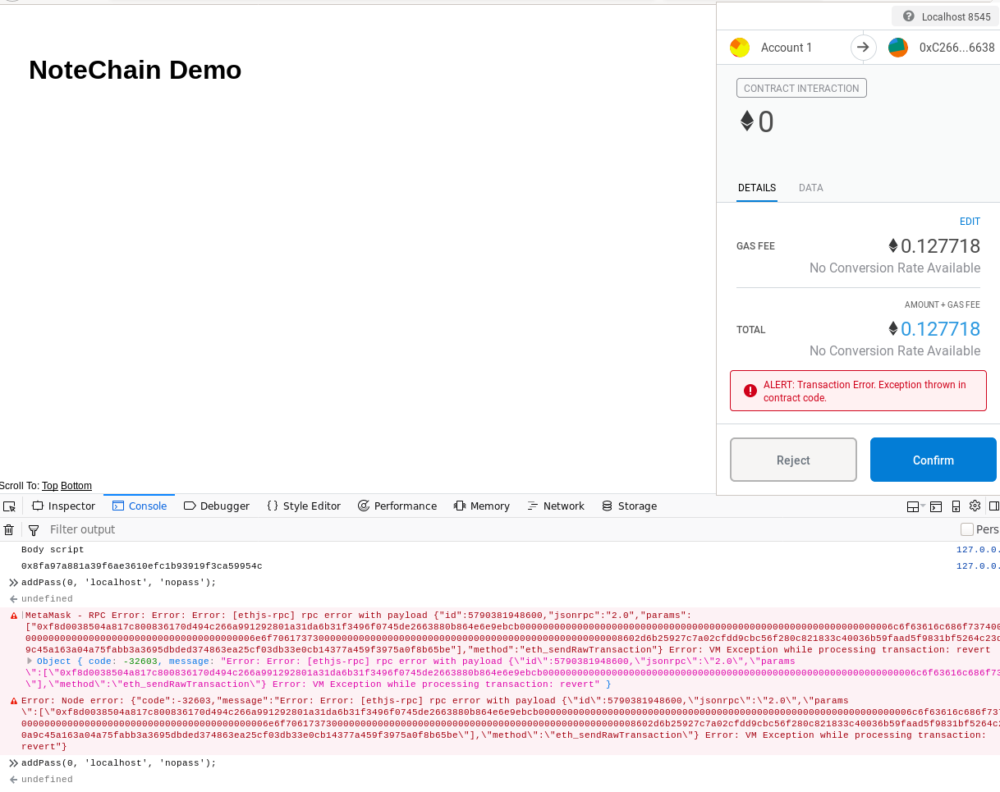

# 11 - Contract Issues

I was having a lot of issues communicating with the NoteChain contract, specifically running createNote().

I've created a new [testing branch](https://github.com/dylan-lom/PassMe/tree/testing), and my own Smart Contract (PassMe.sol), to test with &mdash; I've been thinking more critically about how much excess functionality the NoteChain contract needs, and thought it'd be better to just create a new one with only what I need (ie. no public keys/public reading functions).

I've been recieving this error (or similar), when I try to run addPass (the same as createNote, except without public key argument)

MetaMask is able to detect this error before execution, as when I go to accept the transaction it warns:

Troubleshooting I've tried:
* removing the payFee modifier
* creating the `addPass` function/removing the public key
* removing the assigning of an owner to the key (via the passToOwner mapping)
* removing the .push'ing to the ownerPasswds array
* removing the `emit PassAdded`
* changing type of arguments `_href` (`_title`) and `_pass` (`_content`) to string (from bytesX)

The issue was that I wasn't supplying a `value: x` option in `.send({...})`, which lead to the failure of contract execution. Which I caught when I ran across the amusingly titled [VM Exception while processing transaction: Revert](https://vmexceptionwhileprocessingtransactionrevert.com/) page.

Now I can happily run `addPass` as so:

<pre><code>contract.methods.addPass(0, \_web3.utils.asciiToHex('href',12), \_web3.utils.asciiToHex('password', 32)).send({from: acc, value: \_web3.utils.toWei('0.0002')});</code></pre>

However, I still get the error when calling `getPass`: `MetaMask - RPC Error: Internal JSON-RPC error. Object { code: -32603, message: "Internal JSON-RPC error." }`

One concern that I've had is the actually implementation details of a chrome extension that inherently relies on another extension (MetaMask).

I'm not sure what the interaction between the two will be when my extension causes a popup from MetaMask? I think this might cause some issues with my extension's function.

One nice thing about the HTML nature of the extension is that it should be fairly trivial to first develop a standalone webpage, and then attempt to port it to a chrome extension (simply by including a `manifest.json`, which Chrome interprets to create an extension in the browser).

On another note, one of the upsides to using the NoteChain contract is that it's [already deployed on the mainnet](https://etherscan.io/address/0xD4737858Dd8eb9842CD0696171b781525B56086f), meaning that if someone wants to actually use my project they can (whereas I don't currently own any ETH, meaning that I wouldn't be able to deploy my contract to the mainnet).

## Other Changes/Issues
The following additional changes have been made to my test page (v3 in the testing branch)
* Set `_web3.eth.defaultAccount`, instead of saving a global variable acc; defaultAccount is used for the `from: ` field automatically, when none is supplied.
* Added the alias function `getPassCount` (js), which evokes the contract method of the same name, and returns the output, converted hex=>number

The following issues were encountered:
* The first time a tab calls `ethereum.enable()`, it is async, but all of the following times it isn't and including an await statement causes an error, I'm not really sure how to fix this, since I would need some sort of initialisation page that had an await, and then the actual interactive page wouldn't?

